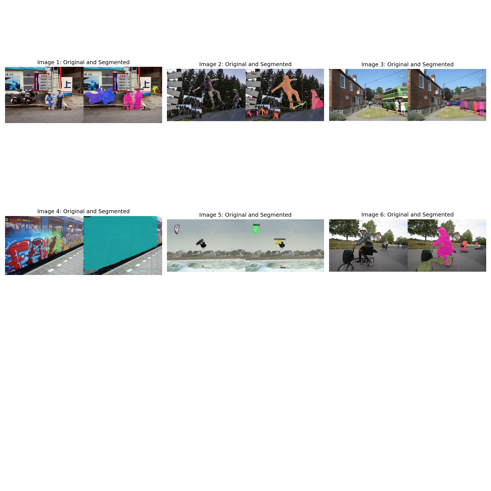
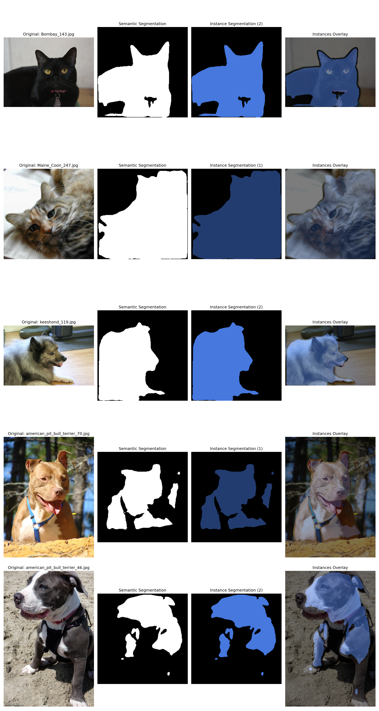

# Image Segmentation with Instance Recognition

Two complementary approaches to instance segmentation: **Mask R-CNN** (two-stage detector) and **Instance U-Net** (encoder-decoder with embedding heads). Both perform pixel-level segmentation and distinguish individual object instances.




## Features

### Mask R-CNN
- Pre-trained ResNet-50-FPN backbone (COCO weights)
- Instance masks with bounding boxes and class labels
- Targeted COCO dataset download for demos
- Multi-object detection across 80 COCO categories

### Instance U-Net
- Custom U-Net with three output heads (semantic, center, embedding)
- Trained on the Oxford-IIIT Pet Dataset
- Bottom-up instance grouping via pixel embeddings
- Lighter and faster than Mask R-CNN (~8M vs ~40M parameters)

## Requirements

- Python 3.8+
- CUDA-capable GPU recommended

## Installation

```bash
git clone https://github.com/QuantumAce-Code/image-segmentation-instance-recognition.git
cd image-segmentation-instance-recognition

python -m venv venv
# Windows
venv\Scripts\activate
# Linux/macOS
source venv/bin/activate

pip install -r requirements.txt
```

## Usage

### Mask R-CNN demo

```bash
python maskrcnn_demo.py
```

Downloads sample COCO images on first run, runs inference, and saves `maskrcnn_demo_results.png`.

### Instance U-Net demo

```bash
python instance_unet_demo.py
```

Downloads the Oxford Pet dataset on first run and saves `all_instance_results.png`.

### Train Instance U-Net

```bash
python unet_model.py
```

### Mask R-CNN training / evaluation

```bash
python mask_rcnn_segmentation.py
```

## Architecture comparison

| Aspect | Mask R-CNN | Instance U-Net |
|--------|------------|----------------|
| Approach | Top-down (detect then segment) | Bottom-up (segment then group) |
| Parameters | ~40 million | ~8 million |
| Speed | Moderate | Faster |
| Best for | Multi-class scenes | Single-category focus |
| Pre-trained on | COCO (80 classes) | Oxford Pets |

## Project structure

```
Image_Segmentation_with_Instance_Recognition/
├── mask_rcnn_segmentation.py   # Mask R-CNN implementation & training
├── maskrcnn_demo.py              # Mask R-CNN demo script
├── unet_model.py                 # Instance U-Net model & training
├── instance_unet_demo.py         # Instance U-Net demo script
├── maskrcnn_demo_results.png     # Sample Mask R-CNN output
├── all_instance_results.png      # Sample U-Net output
├── Documentation.txt             # Technical report
├── HowToExplainCode.txt          # Code walkthrough guide
├── requirements.txt
├── README.md
└── LICENSE
```

## Applications

- Autonomous driving (vehicles, pedestrians, obstacles)
- Medical imaging (tumor/cell instance segmentation)
- Industrial quality control (defect detection)

## License

MIT License — see [LICENSE](LICENSE).

Pre-trained weights from torchvision (COCO) and the Oxford Pet dataset are subject to their respective licenses.